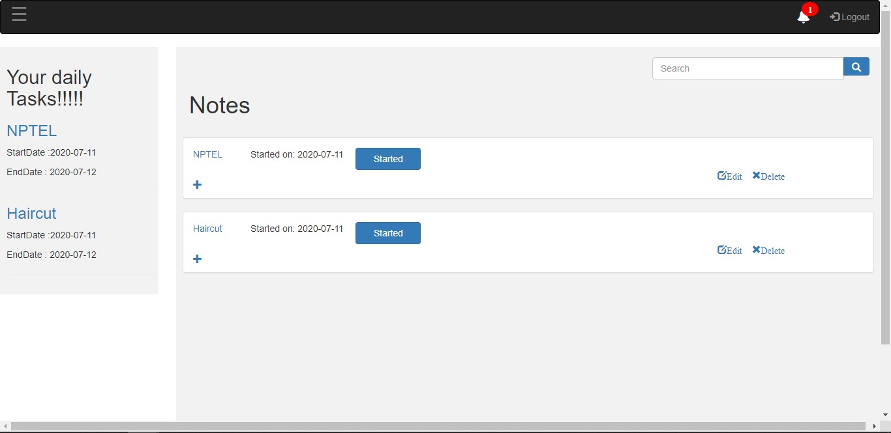

## About
A web app to track daily work, schedules and to remind the user.

## Application Features ##
*	People can register in this application to set their reminders.
*	Once the registration is completed. Registered user can log in to the application.
*	User can create a notebook.
*	Inside Notebook user can create list of notes for reminder.
*	User can set start date , end date and reminder date while creating notes.
*	Once the user is logged in, the application will take current date of the system and compares it to the reminder date and displays all the reminders.
*	Daily task for user is displayed on front page.
*	User can also search their notes and notebooks individually.
*	User can also change their reminder date by editing required note data.
*	Registered user can also edit their profiles.
*	Once the task is completed user can remove those note from notebook.
*	The notebook can be removed only if it doesn’t have any notes.

## Database Schema ##


**The script to create the schema is included in the project**
* User :
  * **Primary key :** id
* Notebook :
  * **Primary key :** id
  * **Foreign Key :** user_id
* Note :
  * **Primary key :** id
  * **Foreign Key :** user_id, status_id, tag_id, noteBook_id;
* status :
  * **Primary key :** id
* tag :
  * **Primary key :** id
## Technology Stack ##
* Spring MVC with Maven
* Hibernate
* jQuery with ajax
* HTML, CSS, JavaScript
* MySQL
## Dependencies ##
**Included in pom.xml**
* activation-1.0.2
* asm-1.5.3
* asm-attrs-1.5.3
* antlr-2.7.6
* aopalliance-1.0
* aspectjweaver-1.6.11
* cglib-2.1_3
* commons-beanutils-1.7.0
* commons-collections-2.1.1
* commons-digester-1.8
* commons-email-1.0
* commons-fileupload-1.3
* commons-io-1.1
* commons-lang-2.5
* commons-logging-1.1.1
* dom4j-1.6.1
* dumbster-1.6
* ehcache-1.2.3
* gson-2.8.3
* hibernate-3.2.6.ga
* hibernate-annotations-3.3.1.GA
* hibernate-commons-annotations-3.0.0.ga
* hibernate-entitymanager-3.3.2.GA
* hibernate-search-3.0.0.GA
* hibernate-validator-4.0.2.GA
* icu4j-2.6.1
* javassist-3.4.GA
* javax.servlet-api-4.0.1
* jaxb-api-2.1
* jaxb-impl-2.1.3
* jaxen-1.1.1
* jdom-1.0
* jstl-1.2
* jta-1.1
* log4j-1.2.14
* lucene-core-2.3.2
* lucene-highlighter-2.0.0
* mysql-connector-java-5.1.49
* persistence-api-1.0
* quartz-1.5.2
* slf4j-api-1.5.6
* slf4j-log4j12-1.5.6
* spring-aop-3.0.1.RELEASE
* spring-asm-3.0.1.RELEASE
* spring-beans-3.0.1.RELEASE
* spring-context-3.0.1.RELEASE
* spring-core-3.0.1.RELEASE
* spring-expression-3.0.1.RELEASE
* spring-jdbc-3.0.1.RELEASE
* spring-orm-3.0.1.RELEASE
* spring-tx-3.0.1.RELEASE
* spring-web-3.0.1.RELEASE
* spring-webmvc-3.0.1.RELEASE
* stax-api-1.0-2
* validation-api-1.0.0.GA
* xalan-2.6.0
* xercesImpl-2.6.2
* xml-apis-1.3.02
* xmlParserAPIs-2.6.2
* xom-1.0

## Screenshot

For more [Screenshots](https://github.com/manojkumar-examly/projects/tree/abilash-jul10/Remind-Me-App/Documents/Screenshots).

## Deploying in Examly IDE
### 1.Connect to MySQL Server:

    mysql -u root --protocol=tcp -p
   - Execute the Schema given in the Documents
        `script_to_create_sql_schema.sql`

### 2.Deploy:

    mvn clean install
    
    
    mvn tomcat7:run-war

## API
* **REQUEST**
  ```
   :method: POST
   :path: /listOfNotification.do
   :scheme: https
  ```
  **RESPONSE**
   ```
    content-type: text/html;charset=ISO-8859-1
    status: 200
   ```
* **REQUEST**
   ```
    :method: POST
    :path: /addNotes.do
    :scheme: https
   ```
  **RESPONSE**
   ```
     content-type: text/html;charset=ISO-8859-1
     status: 200
   ```
